<!-- GitHub profile of Janin A Apurba. © Janin A Apurba, CSE, AUST · Advanced ICT Officer, CNRS-UNHCR -->

  

  
  
  
   
  
  
  
  

  <b>I work on computer vision that holds up outside the lab: on crowded roads, in classrooms and in humanitarian settings. 
  I give what I learn away for free.</b> 
  I am looking for a <b>fully funded PhD in AI</b> and for <b>sponsors</b>. Every sponsored project is released <b>open for all</b>.

---

## 🎓 At a glance, for PhD committees and funders

- 🎯 **Seeking:** a fully funded PhD in AI, in computer vision and deep learning.
- 🔬 **Research focus:** robust, efficient and fair vision models that work outside benchmark conditions, for road safety, humanitarian settings and education.
- 📝 **Research record:**
  - 1 paper in the publication process: real-time facial-expression analysis with YOLOv11.
  - 3 undergraduate theses: pedestrian risk, vehicle over-speed and brain-tumor classification.
- 💼 **Now:** Advanced ICT Officer at **CNRS-UNHCR** since October 2025. I teach students digital and ICT skills in a humanitarian setting.
- 🧪 **Before:** Research Assistant at **Robo Tech Valley**, Dhaka (March–July 2025), working on AI/ML and computer-vision projects.
- 🏛️ **Education:** B.Sc. in Computer Science & Engineering, **Ahsanullah University of Science and Technology (AUST)**, 2025.
- 🌍 **Open science:**
  - 273 free written lectures and 110 free animated video lectures;
  - every sponsored project is released open for all.
- ⚡ **Algorithms:** 10+ years of competitive programming.

  

---

## 🔬 Research

> My research interests centre on **computer vision and deep learning for real-world safety and human understanding**, particularly in developing countries such as Bangladesh.
>
> My undergraduate research tackled pedestrian detection with risk-level classification for Bangladeshi road scenes, and vision-based vehicle over-speed detection. My current work studies real-time facial-expression analysis with YOLOv11.
>
> I want to develop robust, efficient and fair vision models that work reliably outside benchmark conditions, for road safety, humanitarian applications and education.

| Project | Area | Status |
|---|---|---|
| **Emotion Detection at Lightning Speed: Leveraging YOLOv11 for Facial Expression Analysis** | Real-time facial-expression recognition | 📝 In the publication process |
| **Pedestrian Detection and Risk Level Classification in Perspective of Bangladesh** | Object detection · road safety | 🎓 Undergraduate thesis |
| **Car Speed Checker and Over-Speed Penalty System** | Vehicle speed estimation · intelligent transport | 🎓 Undergraduate thesis |
| **Brain Tumor Detection and Classification** | Medical imaging · CNNs | 🎓 Undergraduate thesis |
| **[People Height Annotation](https://github.com/Apurba94/annotated_frame_dataset)**: detect, track and measure people in video with YOLO pose and ByteTrack | Pose estimation · tracking | 💻 Open source |

### Questions I want to pursue in a PhD

1. **Beyond the benchmark:** How can detectors stay reliable on dense, unstructured roads, with rickshaws, buses and pedestrians sharing a lane in rain or at night, when they were trained on data from elsewhere?
2. **Real-time on modest hardware:** How far can YOLO-class models be compressed for edge devices without losing accuracy on the cases that matter most for safety?
3. **Fair human understanding:** Do expression and pose models work equally well across ages, skin tones and cultures? How do we measure the gaps and close them?
4. **AI for humanitarian settings:** How can vision and learning systems responsibly support education and services in refugee and low-resource contexts?

---

## 🤝 Sponsor a project, and it becomes open for all

  

I build in the open, but compute, data and publishing cost real money.

**My pledge:** when a project is sponsored, I release it openly and free for anyone to learn from, use and build on. That includes:
- the source code;
- the trained model weights;
- the datasets, with personal data anonymised and consent respected;
- an open-access paper;
- lessons on my free teaching sites.

**What sponsorship pays for**
- 🖥️ GPU compute to train and evaluate vision models
- 🏷️ Collecting and annotating real-world data, such as Bangladeshi road scenes
- 📄 Open-access publication fees, so the papers are free to read
- 🎬 More free lectures and animated lessons
- ✈️ Travel to present the work at conferences

**Projects open for sponsorship**

| Project | Today | Once sponsored |
|---|---|---|
| Pedestrian detection and risk classification (Bangladesh) | Thesis, unpublished | Open dataset, models, code and paper |
| Real-time facial-expression analysis (YOLOv11) | Paper in the publication process | Open code and model weights, open-access paper |
| Vehicle over-speed detection | Thesis, unpublished | Open code and models |
| Brain tumor detection and classification | Thesis, unpublished | Open code and models |
| [Educational rocket-orbit prototype](https://github.com/Apurba94/educational-rocket-orbit-prototype) | Source code on request | Full source code open to everyone |
| [The AI Lecture Hall](https://ai-lecture-hall.vercel.app) and [AI in Motion](https://ai-in-motion.vercel.app) | Free to read and watch | New lectures, still free for everyone |

**Sponsors get:**
- acknowledgement in the repository, papers and lectures;
- regular progress updates;
- a direct line to me throughout the project.

  
  

---

## 📚 Free teaching, open to everyone

  
  

- **[The AI Lecture Hall](https://ai-lecture-hall.vercel.app)** · [source](https://github.com/Apurba94/ai-lecture-hall)
  - 273 university-level lectures in 10 tracks.
  - Covers AI foundations and mathematics through transformers, diffusion models, reinforcement learning, MLOps and AI ethics.
  - Each lecture includes derivations, code and exercises.
- **[AI in Motion](https://ai-in-motion.vercel.app)** · [source](https://github.com/Apurba94/ai-in-motion)
  - 110 animated video lectures: more than 8 hours, including 36 deep dives of 10+ minutes.
  - Narration, subtitles, chapters, quizzes and printable illustrated notes.
  - Every animation is computed live from the real algorithm: gradient descent really descends and Q-learning really learns.
- **Teaching at CNRS-UNHCR**: ICT and digital skills for students.
- **YouTube**: [Study with Janin](https://www.youtube.com/@studywithjanin) and [Pomodoro Study with Janin](https://www.youtube.com/@pomodorostudywithjanin3326).

---

## 🛠️ Selected engineering work

| Project | What it does | Stack |
|---|---|---|
| **[CodeArena](https://github.com/Apurba94/codearena)** | An online judge like Codeforces and LightOJ: a sandboxed judge for 8 languages, ICPC-style contests, Elo ratings and an archive of about 26,000 problems | Node.js · SQLite · Python sandbox |
| **[Instant Solver](https://github.com/Apurba94/instant-solver)** | Solves competitive-programming problems, then tries to break each solution by stress-testing it against an independent brute force in a sandbox | Python |
| **[People Height Annotation](https://github.com/Apurba94/annotated_frame_dataset)** | Detects, tracks and measures people in video, with an annotated video, per-frame CSV and a Colab notebook | Python · YOLO pose · ByteTrack |
| **[AI in Motion engine](https://github.com/Apurba94/ai-in-motion)** | A zero-dependency canvas animation engine with 137 algorithm "scene kits" | JavaScript |
| **[SMS/Email Spam Classifier](https://github.com/Apurba94/SMS-Email-Spam-calssifier-Dtection)** | Compares machine-learning classifiers on the SMS Spam Collection | Python · Jupyter |
| **[Zone Analyst](https://github.com/Apurba94/zone-analyst)** | Blue-zone and fight analytics for PUBG Mobile: a website, a Python research toolkit and a mobile app | Python · Expo |

<b>More: games, apps and university projects</b>

 

| Project | Description | Stack |
|---|---|---|
| [Janin: Orbit Relay](https://github.com/Apurba94/janin-game) | Online multiplayer arena game with a WebSocket room server and an Android build | JavaScript · Capacitor |
| [Mr Janin & Mrs Janin](https://github.com/Apurba94/mr-janin-and-mrs-janin-fps-game) | Wave-based first-person arena shooter for the browser | Babylon.js · React |
| [Janix Mobile](https://github.com/Apurba94/janix-mobile) | Top-down battle-royale browser game | Babylon.js · TypeScript |
| [Janin's Five](https://github.com/Apurba94/card-game-created-by-janin) | Mobile card game with a bot opponent and online rooms | Expo · React Native |
| [Mrs Janin](https://github.com/Apurba94/mrs-janin-jumping-2d-game) | Mobile-first 2D side-scrolling runner | JavaScript · Capacitor |
| [Taskly](https://github.com/Apurba94/todo-mobile-app) | Offline-first task manager for iOS, Android and web | Expo · React Native |
| [AUST-ICPC](https://github.com/Apurba94/Austicpc) | Tutorials and contest website for the AUST ICPC community | PHP · MySQL |
| [Auto-Parts Management System](https://github.com/Apurba94/Auto_parts_shop_Java) | Desktop app for an auto-parts shop | Java Swing · Apache Derby |
| [Shop Management System](https://github.com/Apurba94/Auto-Parts-Shop-Kotlin) | Android app for shop management | Kotlin |
| [Ride Sharing Management System](https://github.com/Apurba94/PL_SQL_Ride_sharing-project) | Database-driven ride-sharing system | Oracle PL/SQL |
| [DARKO FIGHTER](https://github.com/Apurba94/Darko_Fighter_Game-Development) | 2D fighting game built from scratch | C · C++ · iGraphics |
| [Contact Management System](https://github.com/TanvirAS98/ContactManagementSystem) | Database application for contacts | Java · MSSQL |
| [Computer Graphics Project](https://github.com/TanvirAS98/Computer-Graphics-Project) | Interactive graphics project | JavaScript |
| [Previous portfolio](https://github.com/Apurba94/Portfolio_updated) | Earlier personal website ([live](https://apurba94.github.io/Portfolio_updated/)) | HTML · CSS · JavaScript · PHP |

---

## ⚡ Competitive programming

- **10+ years** of contest problem solving, since 2014, on Codeforces, CodeChef, HackerRank and other platforms.
- Recognised for outstanding performance in online programming contests.
- 📈 Profile: [StopStalk](https://www.stopstalk.com/user/profile/studywithjaninYT)
- 📂 Archives:
  - [10 years of competitive-programming resources](https://github.com/Apurba94/10-Years-of_Competitive-Programming-Resources-Collection)
  - [Codeforces solutions](https://github.com/Apurba94/Codeforces_solve)

---

## 🧰 Skills

| Area | Tools |
|---|---|
| **AI and machine learning** |       |
| **Algorithms and systems** |     |
| **Web and backend** |     |
| **Data** |     |
| **Tools** |     |

---

## 📜 Selected certifications

- [Advanced Learning Algorithms](https://coursera.org/share/7e66ff52f42131751e74138d024bb7e6) · DeepLearning.AI & Stanford Online
- [Unsupervised Learning, Recommenders, Reinforcement Learning](https://coursera.org/share/362fa78c14a6697b30a2c97e1a3721c8) · DeepLearning.AI & Stanford Online
- [Divide and Conquer, Sorting and Searching, and Randomized Algorithms](https://coursera.org/verify/P5Q32DHMY98V) · Stanford University
- [Advanced Algorithms and Complexity](https://coursera.org/verify/KBU9LT9VLHUD) · UC San Diego
- [Object-Oriented Data Structures in C++](https://coursera.org/verify/2EDZ4XBHE754) · University of Illinois Urbana-Champaign
- [Data Scientist Career Track](https://learn.365datascience.com/c/a50678781c/) · 365 Data Science: exams in ML, deep learning, SQL, mathematics, probability and statistics
- [Convolutional Neural Networks with TensorFlow in Python](https://learn.365datascience.com/c/acd81164cf/) · 365 Data Science
- [MLOps Bootcamp](https://drive.google.com/file/d/1rxdQJdeHtUICDsdqXRPPObPKygO0yxf8/view?usp=sharing) · DataMites
- [Introduction to DevOps](https://coursera.org/verify/GYNEKC3BC67K) · IBM

📁 **[All 39 certificates (Google Drive)](https://drive.google.com/file/d/1ZtTrdRvy5aP6SnO6LRi9LS7rbMhhSLzo/view?usp=sharing)**

## 🏅 Awards and training

- 🥇 **Talent Pool Scholarship** (2008): ranked 4th in Kurigram District.
- 🏆 **Competitive-programming awards** for performance in online contests.
- 🧠 **Microsoft MVP Program trainee**, Dhaka: workshop on AI, computer vision and Microsoft Azure.
- 🔶 **Google Developer Group TensorFlow workshop**, Dhaka: AI, machine learning and data mining.

---

## 📫 Contact

- 📧 **Email:** [japurba97@gmail.com](mailto:japurba97@gmail.com)
- 🌐 **Academic portfolio:** [janin-a-apurba.vercel.app](https://janin-a-apurba.vercel.app)
- 📄 **CV:** [Google Drive](https://drive.google.com/file/d/1mU4Bvls94U_ONTf8E_qwJWF8cLZ8rpnS/view?usp=sharing)
- 👥 **References:** academic references from AUST CSE faculty are available on request.

## ▶️ Follow Janin on YouTube

If my work helped you, please follow and subscribe:

- **Study with Janin**: [youtube.com/@studywithjanin](https://www.youtube.com/@studywithjanin)
- **Pomodoro Study with Janin**: [youtube.com/@pomodorostudywithjanin3326](https://www.youtube.com/@pomodorostudywithjanin3326)

---

© Janin A Apurba, CSE, AUST · Advanced ICT Officer, CNRS-UNHCR

